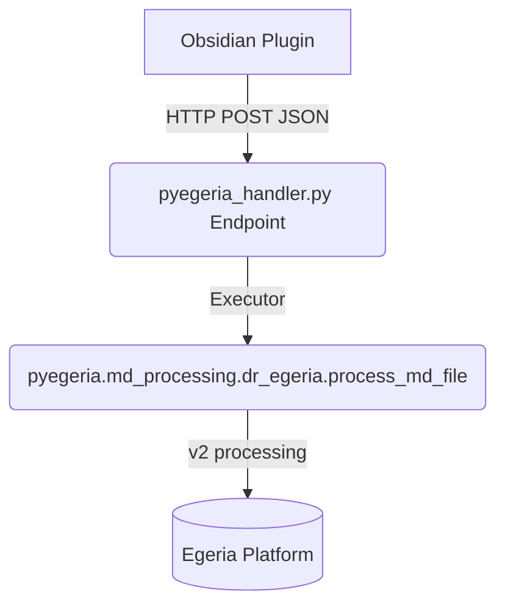

# Dr. Egeria Web Handler Architecture & Usage

This document outlines the updated architectural structure and usage for the `pyegeria-web` containers across Egeria workspaces (`egeria-quickstart` and `egeria-freshstart`). This modernizes the bridge between your markdown front-ends (such as Obsidian) and the backend Dr. Egeria V2 processing logic.

## Overview of the New Design

The legacy design required maintaining complex, 300+ line Python scripts (`dr_egeria_md.py`) directly within each workspace’s web handler container. Because Dr. Egeria V2 has been refactored into a full asynchronous backend system distributed directly within the `pyegeria` library, those shadow scripts created technical debt and fragmentation.

The new architecture centralizes this:
1. **Centralized Logic**: The workspace `pyegeria-web` endpoints no longer manage markdown dispatching loops manually.
2. **Direct Package Hook**: `pyegeria_handler.py` FastAPI app imports `process_md_file` straight from `pyegeria.md_processing.dr_egeria`.
3. **Clean Execution**: The web handler wraps the call in a thread executor and relies entirely on PyEgeria's native `V2Dispatcher`.



## Obsidian Plugin Integration

The Obsidian Plugin (`cal-dr-egeria/main.ts`) serves as the client making REST requests to trigger the processing workflows. 

> [!NOTE] 
> The payload JSON schema required from the plugin remains identical to V1 standards, meaning the plugin requires **no changes** to support the V2 backend!

When you click "Call Dr.Egeria," the plugin constructs the following payload:
```json
{
    "input_file": "myfile.md",
    "output_folder": "Monday",
    "directive": "process",
    "url": "https://host.docker.internal:9443",
    "server": "qs-view-server",
    "user_id": "erinoverview",
    "user_pass": "secret"
}
```

The FastAPI application maps this body directly into internal kwargs over the method:
```python
def _invoke_processor(req: ProcessRequest) -> str:
    return _run_and_capture(
        process_md_file,
        input_file=req.input_file,
        output_folder=req.output_folder or "",
        directive=req.directive,
        server=req.server,
        url=req.url,
        userid=req.user_id,
        user_pass=req.user_pass,
    )
```

## Usage Guidelines

### 1. Refreshing PyEgeria Package versions
Whenever you publish new features or adjustments to Dr. Egeria V2 to pip/TestPyPI, you will only need to rebuild the standard `Dockerfile-fast-api`.
```bash
docker compose build pyegeria-web
docker compose up -d pyegeria-web
```
This Dockerfile runs `pip install --no-cache-dir pyegeria --upgrade`, guaranteeing the web handler pulls in the latest markdown specs dynamically without managing script updates locally.

### 2. Monitoring the Engine 
> [!TIP]
> The `V2Dispatcher` provides deep console logging and analysis tables when it parses the commands. Because `pyegeria_handler.py` utilizes the custom `_run_and_capture` method overriding `sys.stdout`, all `rich.Console` summaries generated by V2 are safely routed back to your Obsidian screen in real-time or stored in your workspace's terminal logs.

### 3. File Contexts
Because we preserve the same directory mounting strategies, your `dr-egeria-inbox` and `dr-egeria-outbox` sync perfectly with the container's expectations. Dr. Egeria V2 uses `input_file` to look into the mounted root path's inbox and outputs standard `processed-YYYY-MM-DD-filename.md` logs back into your configured `output_folder`.
